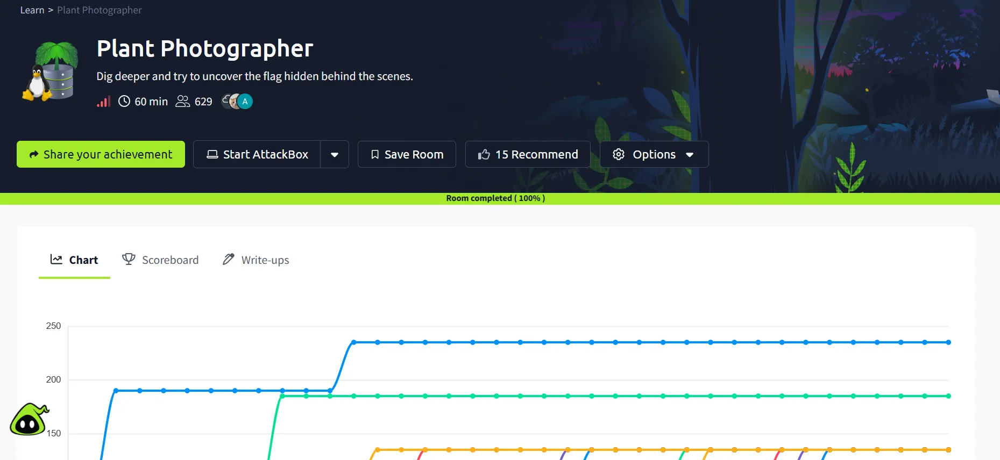

# ✈️ Plant Photographer — TryHackMe CTF Walkthrough

<p align="center">
  
</p>

<p align="center">
  
  
  
  
</p>

<p align="center">
  
  
  
  
</p>

---

## 📌 Overview

**Plant Photographer** is a Hard-difficulty Linux/web security challenge demonstrating how a server-side download primitive can be chained into local file disclosure, source recovery, Flask debug analysis, Werkzeug PIN reconstruction and remote code execution.

This repository presents the room as a professional penetration-testing case study rather than a casual answer sheet.

> **Public flag policy:** TryHackMe challenge flags are intentionally redacted.

## 🎯 Objectives

- Perform reconnaissance and service fingerprinting.
- Identify the server-side fetch mechanism.
- Convert the fetch primitive into local file disclosure.
- Recover application source and security-sensitive configuration.
- Analyze Flask/Werkzeug debug behavior.
- Reconstruct the debugger PIN from leaked target metadata.
- Authenticate to the debugger while preserving session state.
- Obtain code execution and enumerate the application directory.

## 🧠 Skills Demonstrated

| Domain | Techniques |
|---|---|
| Reconnaissance | RustScan, Nmap |
| Web Enumeration | feroxbuster, endpoint analysis |
| Web Security | SSRF-style backend fetch, LFI |
| Flask Analysis | Werkzeug fingerprinting, debug-mode analysis |
| Source Disclosure | Local file retrieval |
| Host Enumeration | `/proc`, sysfs, container metadata |
| Logic Analysis | Werkzeug PIN derivation |
| Exploitation | Debug console authentication and RCE |
| Reporting | Findings, attack-chain analysis, remediation |

## ⚙️ Lab Information

| Property | Value |
|---|---|
| Platform | TryHackMe |
| Room | Plant Photographer |
| Difficulty | Hard |
| Target OS | Linux |
| Web Stack | Werkzeug / Flask |
| Environment | Authorized Lab |

## 🛠️ Tools Used

| Tool | Purpose |
|---|---|
| RustScan | Rapid port discovery |
| Nmap | Service/version detection |
| curl | HTTP interaction and file retrieval |
| feroxbuster | Web content discovery |
| Python | Numeric conversion and PIN reconstruction |
| Burp Suite | Request analysis and validation |

## 🔍 Attack Methodology

```text
Reconnaissance
      ↓
Service Enumeration
      ↓
Web Application Discovery
      ↓
SSRF-style Download Primitive
      ↓
file:// Local File Disclosure
      ↓
Application Source Recovery
      ↓
Flask Debug Mode Confirmation
      ↓
Werkzeug PIN Reconstruction
      ↓
Debug Console Authentication
      ↓
Python Code Execution
      ↓
Application Directory Enumeration
```

## 🗂️ Repository Structure

```text
Plant-Photographer-TryHackMe-Walkthrough/
│
├── README.md
├── _config.yml
│
├── Documentation/
│   ├── THM_Plant_Photographer_Documentation.md
│   ├── THM_Plant_Photographer_Report.docx
│   └── README.md
│
├── Resources/
│   ├── notes.md
│   ├── payloads.md
│   ├── tools.md
│   ├── references.md
│   └── remediation.md
│
├── docs/
│   ├── index.md
│   └── assets/
│       ├── room-completed.png
│       ├── attack-chain.png
│       └── css/
│           └── custom.scss
│
└── Screenshots/
    └── figure-1-room-completion.png
```

## 🛡️ Security Findings

| Finding | Severity |
|---|---|
| `file://`-capable server-side fetch | Critical |
| Exposed Flask debug console | Critical |
| Derivable Werkzeug debug PIN | Critical |
| Application source disclosure | High |
| Detailed debug traceback | High |
| Flask process running as root | Critical |

## 📖 Documentation

- [Complete Technical Walkthrough](Documentation/THM_Plant_Photographer_Documentation.md)
- [Professional Word Report](Documentation/THM_Plant_Photographer_Report.docx)
- [GitHub Pages](docs/index.md)
- [Technical Notes](Resources/notes.md)
- [Remediation](Resources/remediation.md)

## 🚩 Flag Policy

```text
Flag 01 → [REDACTED]
Flag 02 → [REDACTED]
Flag 03 → [REDACTED]
```

## ⚠️ Disclaimer

This repository documents activity against an authorized TryHackMe training environment. Do not apply these techniques to systems without explicit authorization.

## 👨‍💻 Author

**Anurag Ravankar**  
Cybersecurity • Penetration Testing • Web Security • CTF Research
